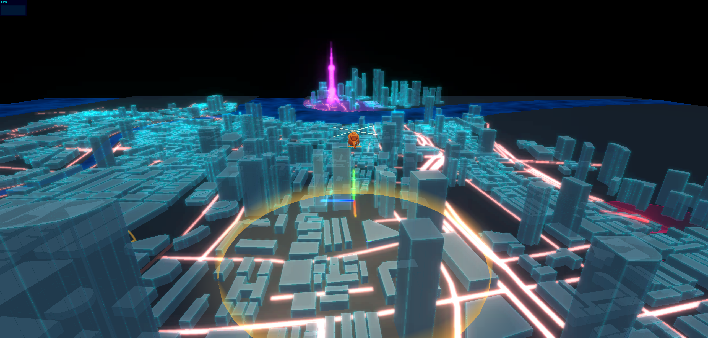

# 首页
<p align="center">
    
    
    
    
</p>

- 该项目是基于threejs开发的数字城市项目，功能用到着色器、辉光、线框描边效果。

- 如果觉着还不错的话，就请点个 ⭐star 支持一下吧，这将是对我最大的支持和鼓励！

### 页面展示

1、首页（图片效果为加速后效果）

 <table>
    <tr>
        <td></td>
    </tr>
  </table>


### 技术栈

```
threejs
```

### 开发功能点

#### 2022-4-29

```
1、完成基础模型搭建
2、创建湖面
3、添加手动飞机巡航功能
4、东方明珠辉光
5、定点着色器特效
6、道路添加发光效果
7、建筑获取点位信息并叠加线框。
```

#### 待完善点

```
1、飞机自动转向
```

